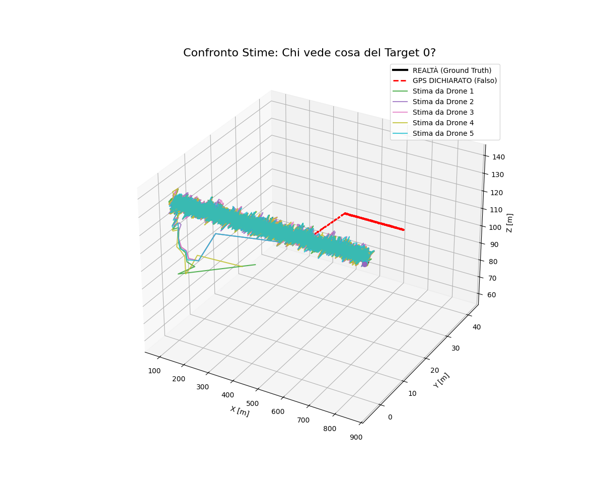
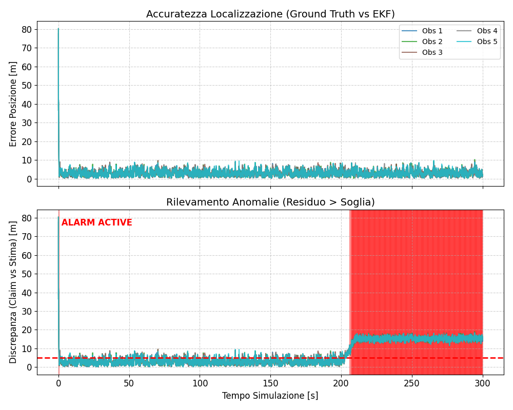

<h1 align="center">📡 TDoA Multilateration for UWB Swarm Simulation & Security</h1>

<p align="center">
  <strong>High-fidelity ns-3 simulation for distributed localization, clock synchronization, and GPS spoofing detection.</strong>
</p>

<p align="center">
  
</p>

---

## Overview

This project implements a **Distributed Extended Kalman Filter (EKF)** framework within **ns-3** to simulate autonomous drone swarms utilizing **Ultra-Wideband (UWB)** technology. It focuses on **Time Difference of Arrival (TDoA)** multilateration to estimate relative positions without relying solely on GPS.

Crucially, it includes a **Cyber-Physical Security Layer** designed to detect **GPS Spoofing attacks**. By cross-referencing claimed GPS positions with physics-based TDoA ranging data, the system identifies anomalies and triggers alarms when a drone's reported position contradicts the UWB measurements.

### Key Capabilities
* **Physics-Based UWB Channel**: Realistic propagation modeling including Path Loss, Shadowing, and LOS/NLOS stochastic determination.
* **Distributed Estimation**: Each drone runs an independent EKF bank to track neighbors (Position $x,y,z$ + Clock Bias).
* **Clock Synchronization**: Implements a Master Anchor synchronization scheme to mitigate hardware clock drift.
* **Security & Anomaly Detection**: Real-time detection of malicious nodes broadcasting false GPS coordinates.

---

## Simulation Results

### 1. 3D Trajectory Reconstruction vs. Attack
The system tracks the true trajectory of the target. When a **GPS Spoofing attack** occurs (Red dashed line), the EKF estimates (Blue/colored lines) maintain the physics-based trajectory, revealing the discrepancy.

<p align="center">
  
</p>

### 2. Security Alarm System
The plot below demonstrates the **Anomaly Detection** mechanism. 
* **Top:** The estimation error remains low during normal operations.
* **Bottom:** When the attack starts (approx. t=200s), the **Discrepancy (Residual)** between the claimed GPS and the TDoA estimate spikes, triggering the **ALARM ACTIVE** state (Red Zone).

<p align="center">
  
</p>

---

## Technical Architecture

### The UWB Channel Model
Custom `UWBChannel` class simulating environmental effects based on IEEE 802.15.4a standards:
* **LOS Probability**: $P_{LOS} = \exp(-d / \gamma)$ based on environment (Indoor/Outdoor).
* **Ranging Error**: Gaussian noise for LOS, plus Biased Noise for NLOS conditions.

### Extended Kalman Filter (EKF) State
Each drone maintains a state vector $\mathbf{x}$ for every neighbor:
$$\mathbf{x} = [x, y, z, v_x, v_y, v_z, \delta t]^T$$
Where $\delta t$ represents the clock bias relative to the observer.

---

## Dependencies

To build and run this simulation, ensure you have the following installed:

* **[ns-3](https://www.nsnam.org/)** (v3.30+ recommended)
    * Modules: `core`, `network`, `mobility`, `wifi`, `applications`.
* **[Eigen3](https://eigen.tuxfamily.org/)**: Required for EKF matrix operations.
* **CMake** (v3.3+).
* **Python 3** (Matplotlib, Pandas, NumPy) for plotting.

---

## Installation & Usage

1.  **Clone the repository in `ns-3-allinone/ns-3.46.1/scratch`**:
    ```bash
    git clone https://github.com/jacopodilauro/multilateration-tdoa-ns3
    ```

2.  **Move to ns-3 directory**:
    Assuming you have ns-3 installed:
    ```bash
    cd ns-3-allinone/ns-3.46.1/
    ```

3.  **Configure & Build**:
    ```bash
    ./ns3 configure --enable-examples --enable-tests
    ./ns3 build
    ```

4.  **Run the Simulation**:
    ```bash
    ./build/tdoa-uwb-run
    ```
    *This generates a `tdma_security_log.csv` file containing the telemetry.*

5.  **Visualize Results**:
    Use the provided Python script to generate the 3D plots and error analysis:
    ```bash
    python3 scratch/plot_tdoa.py
    python3 scratch/plot_old.py
    ```

---

## 📄 License

Distributed under the MIT License. See `LICENSE` for more information.

